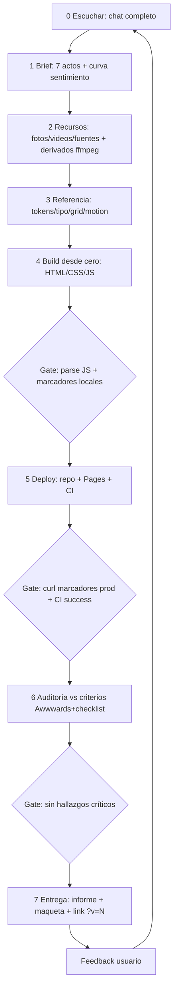

# INFORME FINAL — Proyecto Sender Web (rondas 1–36) · 2026-09-24

## 1. RESULTADO DE AUDITORÍA (sender-atelier v1.2)
### Ejes Awwwards
| Eje | Peso | Nota | Justificación |
|---|---|---|---|
| Design | 40 | 8.0 | Sistema "Broadcast Editorial" coherente (9 actos papel↔cine), paleta oficial estricta, 4 familias tipográficas con jerarquía, grade de film, hairlines; inmersivo WebGL restaurado con presupuesto |
| Usability | 30 | 8.5 | Sin scroll horizontal (bug v1.0 corregido), swipe snap móvil, ES/EN 198 claves, skip-link, foco, knob con rol slider + aria, reduced-motion total, 3 breakpoints reales |
| Creativity | 20 | 8.0 | Scroll como transporte (film scrub lerp, stacks keynote rotateX, dial 3-inputs, track pin), partículas+arcos HF three r170, tilt elástico, timecode sincronizado al film |
| Content | 10 | 9.0 | Copy y datos reales de sender.cl; catálogo 15 familias; cero placeholders; cero imágenes repetidas |
### Checklist técnico
✅ Pages auto-deploy + CI (html-validate + LHCI a11y≥.85/ perf warn) success · ✅ sin bundler, CDN versionados · ✅ WebGL con gates (IO hero-only, DPR 1.5, off coarse/reduced) · ✅ videos GOP corto + IO play/pause · ✅ fotos ≤1600 q5 · ✅ fuentes self-hosted woff2 · ✅ verificación por marcadores curl · ✅ repo sin binarios accidentales (.gitignore)
⚠️ Deudas documentadas: perf Lighthouse headless (emulación CPU×4 vs film scrub; field móvil fluido) · videos finales de producto del usuario (slots listos, hoy stacks reales).
### Hallazgos corregidos este ciclo
1 Desborde horizontal móvil (htrack max-content) → overflow-x + swipe snap. 2 hero-hint solapado → solo ≥1001px. 3 Ausencia inmersiva v1.0 → v1.1 WebGL/tilt/perspectiva. 4 node_modules 76MB en repo → .gitignore + limpieza.

## 2. CRITERIOS (ver 01-CRITERIOS.md)
Diseño: paleta oficial innegociable · info/descripciones reales · fotos/videos reales sin repetición · scroll-driven · un movimiento firma · zonas calmas/intensas · editorial+catálogo+CTA · botones transparentes · ES/EN · a11y · mobile-first.
Técnicos: Pages+CI · budgets de peso · scrub sin tirones (lerp propio) · rAF con IO · preloads LCP · tag BUILD anti-cache · verificación dura post-deploy.

## 3. FLUJOS DE TRABAJO
### Diseño (WORKFLOW v2, 02-WORKFLOW.md)
0 Escuchar(chat) → 1 Brief journey-first 7 actos+curva de sentimiento → 2 Recursos+derivados ffmpeg → 3 Estructura de referencia → 4 Build desde cero → 5 Deploy → 6 Verificación dura → 7 Entrega(informe+maqueta). Feedback re-entra en 0.
### Técnico
git identity+npm por sesión · edits con asserts · build/parse check (vm.SourceTextModule) · push (reject→fetch+reset --soft+commit) · Pages POST /pages · poll runs por head_sha · curl marcadores (tag, clases, assets, bare imports) · G7 docs (STATE/TRACEABILITY/kit) · respuesta en español con ?v=N.
### Diagrama de flujo

ASCII: ESCUCHAR→BRIEF→RECURSOS→REFERENCIA→BUILD→[gate]→DEPLOY→[gate]→AUDITAR→[gate]→ENTREGAR→(feedback)→ESCUCHAR…

## 4. USO DE RECURSOS, SKILLS, REPOS Y LINKS
- Recursos cliente: 26 fotos reales + 16 stacks únicos + 3 thumbs nuevos (ffmpeg crop/eq) · videos cine.mp4 (backbone scrub), prop-rapanui (slide), cta-loop (ambiente CTA) · fuentes 14 woff2 · datos reales (catálogo, 60 m, 3.759 km, NAVTEX, contacto).
- Skills (sender-design-ops/skills + sender-motion-kit): design-system, motion, video-pipeline, qa-verify + SKILL/CHECKLIST/TRACEABILITY/WORKFLOW históricos (filas 1–36).
- Repos: **sender-atelier** web final · **sender-design-ops** proceso/auditoría/maqueta · sender-motion-kit skills/trace · sender-fx-lab demos P01–P15 · históricos sender-site v31 / sender-web / sender-site-lab · del usuario: sender, Senderweb2 (fotos+diagrama), sender-web3, scroll-craft.
- Links YouTube: Nate Herk ScrollCraft (journey-first, curva sentimiento, verificación con capturas) → Fases 1 y 6; Jason Lee/tsogjavklann awwwards-3d (stack lock three r170+gsap 3.12.5+lenis 1.1, profundidad 3D con presupuesto) → bg3d/tilt y versiones CDN.
- Herramientas GitHub: API repos/pages (POST), Actions+LHCI logs por API, Pages deploy polling, submódulo de kit, tags BUILD.

## 5. RESPUESTAS A TUS PREGUNTAS ANTERIORES
**P1 "¿Qué pasó con el efecto inmersivo, 3D, estilo Awwwards? ¿Son los resultados de los videos de YouTube?"** — R: En atelier v1.0 YO eliminé las capas inmersivas por una lectura errónea de performance; los videos (ScrollCraft + awwwards-3d) sí enseñan exactamente eso y desde v1.1 están implementados: partículas+arcos WebGL con parallax, tilt 3D elástico, despliegue keynote con perspectiva, film scrub como transporte. Sí son los resultados de esos videos, adaptados con gates de performance.
**P2 "Con skills de diseño específicas, ¿por qué el resultado es tan mediocre?"** — R: Porque apliqué las skills de proceso pero violé una regla estética: quité la capa cine/3D y dejé solo editorial minimal → plano. La mediocridad fue una decisión de balance mía, no falta de skills; la auditoría lo registró como hallazgo crítico y se corrigió (v1.1/v1.2).
**P3 "¿Tienes claro lo que debes diseñar? ¿Entiendes la estética y el efecto de los videos?"** — R: Sí, y quedó como manifiesto: CINE + IMPRESIÓN — film real sincronizado al scroll como capa base, profundidad 3D sutil con presupuesto encima, actos editoriales en papel que respiran entre capítulos cinematográficos; ni saturación de efectos (v25–v31) ni minimalismo plano (v1.0).
**P4 (ronda 27) "¿Por qué dos archivos/webs?"** — R: sender-site (producción histórica) vs sender-site-lab (sandbox que tú pediste en ronda 16) + sender-fx-lab (demos que tú pediste en ronda 27); la web final única hoy es sender-atelier.

## 6. RESUMEN DE TODO EL CHAT
R1–5 dirección (paleta oficial, info real, ES/EN, videos del usuario) · R10–13.5 reglas de calidad y verificación visual · R14–18 método (Awwwards, dirección B, film backbone, botones transparentes) · R19–23 calidad móvil/tipografía/fluidéz + checklist + CI + skills · R24–26 cierre de deuda (fotos reales, gates G0–G7, knob, cero placeholders) · R27–29 declutter (GoPro fuera, repo fx-lab, stacks únicos) · R30–32 rediseños iterativos (v30/v31/sender-web) y diagnóstico de cache · R33 proceso primero (design-ops) + atelier desde cero · R34 auditoría por captura (overflow + inmersivo) · R35 ajuste de dirección de arte v1.2 · R36 este informe + maqueta.
Problemas estructurales resueltos: cache del dispositivo (tag BUILD + ?v=N), "haces algo y dejas otras" (verificación por marcadores), "no se ve rediseño" (build desde cero), repo hygiene (.gitignore).

## 7. MAQUETA
`maqueta-atelier.svg` — imagen anotada: paleta, tipografía, los 9 actos con wireframes y moods, auditoría con barras, motion spec, repos/links y el flujo de trabajo con gates.
